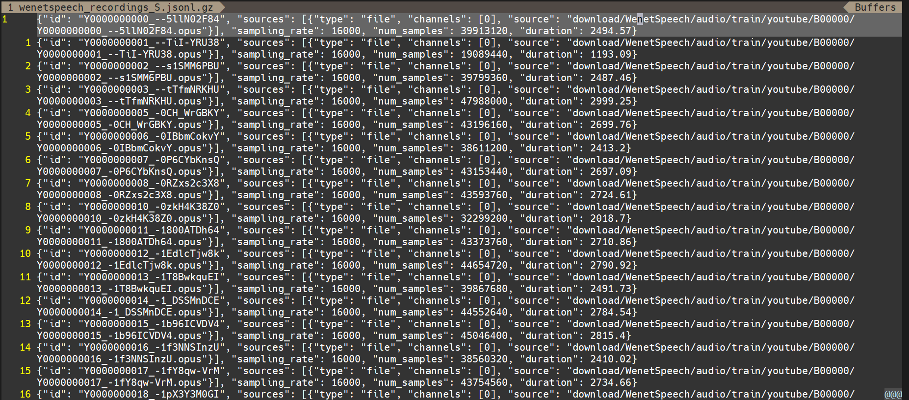
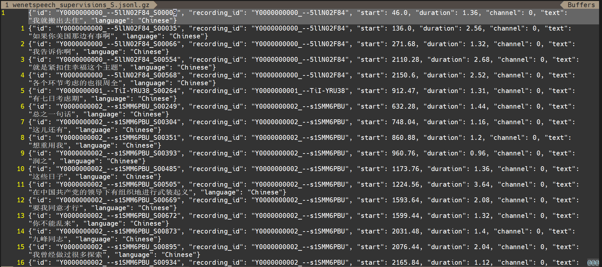

# 如何基于新一代Kaldi框架快速搭建服务端ASR系统
>本文将介绍如何基于新一代Kaldi框架快速搭建一个服务端的ASR系统，包括数据准备、构建recipe训练测试、服务端部署运行。
>
> 更多内容建议参考：
> 
> - [k2](https://github.com/k2-fsa/k2 "k2")
> - [icefall](https://github.com/k2-fsa/icefall "icefall")
> - [lhotse](https://github.com/lhotse-speech/lhotse "lhotse")
> - [sherpa](https://github.com/k2-fsa/sherpa "sherpa")


## 前言
距离新一代Kaldi开源框架的正式发布已经有一段时间了，截止目前，框架基本的四梁八柱都已经立起来了。那么，如何用它快速搭建ASR系统呢？

阅读过前面几期公众文的读者可能都知道新一代Kaldi框架主要包含了四个不同的子项目：k2、icefall、lhotse、sherpa，其中，k2是核心算法库，icefall是数据集训练测试示例脚本，lhotse是语音数据处理工具集，sherpa是服务端框架，四个子项目共同构成了新一代Kaldi框架。另一方面，截止目前，新一代kaldi框架在很多公开数据集上都获得了很有竞争力的识别结果，在WenetSpeech和GigaSpeech上甚至都获得了SOTA的性能，看到这，相信很多小伙伴都已经摩拳擦掌、跃跃欲试了，那么本文的目标就是试图贯通新一代Kaldi的四个子项目，为快速搭建一个服务端的ASR系统提供一个简易的教程。希望看完本文的小伙伴都能顺利搭建出自己的ASR系统。

## 三步搭建ASR服务端系统
本文主要介绍如何从原始数据下载处理、模型训练测试、到得到一个服务端ASR系统的过程，根据功能，分为三步：`数据准备和处理`、`模型训练和测试`、`服务端部署演示`。

(注：本文介绍的ASR系统是基于RNN-T的框架且不涉及外加的语言模型，所以，本文将不涉及WFST等语言模型的内容，如后期有需要，会在后面的文章中另行讲述。)

为了更加形象、具体地描述这个过程，本文以构建一个基于WenetSpeech数据集的[pruned transducer stateless2 recipe](https://github.com/k2-fsa/icefall/tree/master/egs/wenetspeech/ASR, "pruned transducer stateless2 recipe")为例，希望尽可能为读者详细地描述这一过程，也希望读者能够在本文的基础上能够无障碍地迁移到其他数据集的处理、训练和部署使用上去。

(注：使用者应该事先安装好k2、icefall、lhotse、sherpa)
### 第一步：数据准备和处理
对于数据准备和处理部分，所有的运行指令都集成在文件[prepare.sh](https://github.com/k2-fsa/icefall/blob/master/egs/wenetspeech/ASR/prepare.sh "prepare.sh")中，主要的作用可以总结为两个：`准备音频文件并进行特征提取`、`构建语言建模文件`。

#### 准备音频文件并进行特征提取

(注：在这里我们也用了musan对数据进行增广，具体的可以参考prepare.sh中对musan处理和使用的相关指令，这里不针对介绍。)
> - 下载并解压数据

为了统一文件名，这里将数据包文件名变为WenetSpeech, 其中audio包含了所有训练和测试的数据
```
>> tree download/WenetSpeech -L 1
download/WenetSpeech
├── audio
├── TERMS_OF_ACCESS
└── WenetSpeech.json

>> tree download/WenetSpeech/audio -L 1
download/WenetSpeech/audio
├── dev
├── test_meeting
├── test_net
└── train
```
查看WenetSpeech.json文件，部分信息如下所示，WenetSpeech.json中包含了音频文件路径和相关的监督信息：
```
{
    ............

    "audios": [
        {
            "aid": "Y0000000000_--5llN02F84",
            "duration": 2494.57,
            "md5": "48af998ec7dab6964386c3522386fa4b",
            "path": "audio/train/youtube/B00000/Y0000000000_--5llN02F84.opus",
            "source": "youtube",
            "tags": [
                "drama"
            ],
            "url": "https://www.youtube.com/watch?v=--5llN02F84",
            "segments": [
                {
                    "sid": "Y0000000000_--5llN02F84_S00000",
                    "confidence": 1.0,
                    "begin_time": 20.08,
                    "end_time": 24.4,
                    "subsets": [
                        "L"
                    ],
                    "text": "怎么样这些日子住得还习惯吧"
                },
                {
                    "sid": "Y0000000000_--5llN02F84_S00002",
                    "confidence": 1.0,
                    "begin_time": 25.0,
                    "end_time": 26.28,
                    "subsets": [
                        "L"
                    ],
                    "text": "挺好的"
                },

    ............
```
> - 利用lhotse生成manifests

关于lhotse是如何将原始数据处理成jsonl.gz格式文件的，这里可以参考文件[wenet_speech.py](https://github.com/lhotse-speech/lhotse/blob/master/lhotse/recipes/wenet_speech.py, "wenet_speech.py")， 其主要功能是生成recordings和supervisions的jsonl.gz文件
```
>> lhotse prepare wenet-speech download/WenetSpeech data/manifests -j 15
>> tree data/manifests -L 1
├── wenetspeech_recordings_DEV.jsonl.gz
├── wenetspeech_recordings_L.jsonl.gz
├── wenetspeech_recordings_M.jsonl.gz
├── wenetspeech_recordings_S.jsonl.gz
├── wenetspeech_recordings_TEST_MEETING.jsonl.gz
├── wenetspeech_recordings_TEST_NET.jsonl.gz
├── wenetspeech_supervisions_DEV.jsonl.gz
├── wenetspeech_supervisions_L.jsonl.gz
├── wenetspeech_supervisions_M.jsonl.gz
├── wenetspeech_supervisions_S.jsonl.gz
├── wenetspeech_supervisions_TEST_MEETING.jsonl.gz
└── wenetspeech_supervisions_TEST_NET.jsonl.gz
```
这里，可用vim对recordings和supervisions的jsonl.gz文件进行查看, 其中：

wenetspeech_recordings_S.jsonl.gz:
- 

wenetspeech_supervisions_S.jsonl.gz:
- 

由上面两幅图可知，recordings包含了音频文件信息，包括，supervisions包含了文本监督信息。

接下来，我们将对音频数据提取特征。

> - 计算、提取和贮存音频特征

首先，对数据进行预处理，包括对文件进行标准化和对音频进行时域上的增广，可参考文件[preprocess_wenetspeech.py](https://github.com/k2-fsa/icefall/blob/master/egs/wenetspeech/ASR/local/preprocess_wenetspeech.py, "preprocess_wenetspeech.py")。
```
python3 ./local/preprocess_wenetspeech.py
```

其次，切片并对每个切片数据进行特征提取，可参考文件[compute_fbank_wenetspeech_splits.py](https://github.com/k2-fsa/icefall/blob/master/egs/wenetspeech/ASR/local/compute_fbank_wenetspeech_splits.py, "compute_fbank_wenetspeech_splits.py")。

(注：这里的切片是为了可以开启多个进程对大规模数据集进行特征提取，提高效率，如果数据集比较小，对数据进行切片处理不是必须的。)

```
## 这里的L也可修改为M或S, 表示训练数据子集

lhotse split 1000 ./data/fbank/cuts_L_raw.jsonl.gz data/fbank/L_split_1000

python3 ./local/compute_fbank_wenetspeech_splits.py \
    --training-subset L \
    --num-workers 20 \
    --batch-duration 600 \
    --start 0 \
    --num-splits 1000
```

最后，待提取完每个切片数据的特征，将每个子集的所有切片特征数据合并成一个总的特征数据集：
```
## 这里的L也可修改为M或S, 表示训练数据子集

pieces=$(find data/fbank/L_split_1000 -name "cuts_L.*.jsonl.gz")
lhotse combine $pieces data/fbank/cuts_L.jsonl.gz
```

至此，我们基本完成了音频文件的准备和特征提取。接下来，我们将构建语言建模文件。

#### 构建语言建模文件
在RNN-T的模型框架中，我们实际需要的用于训练和建模的建模文件有tokens.txt, words.txt和Linv.pt 。 我们按照如下步骤构建语言建模文件：
> - 规范化文本并生成text

在这一步骤中，规范文本的函数文件可参考[text2token.py](https://github.com/k2-fsa/icefall/blob/master/egs/wenetspeech/ASR/local/text2token.py, "text2token.py").
```
# Note: in Linux, you can install jq with the following command:
# 1. wget -O jq https://github.com/stedolan/jq/releases/download/jq-1.6/jq-linux64
# 2. chmod +x ./jq
# 3. cp jq /usr/bin

gunzip -c data/manifests/wenetspeech_supervisions_L.jsonl.gz \
      | jq 'text' | sed 's/"//g' \
      | ./local/text2token.py -t "char" > data/lang_char/text
```
text的形式如下：
```
 怎么样这些日子住得还习惯吧
 挺好的
 对了美静这段日子经常不和我们一起用餐
 是不是对我回来有什么想法啊
 哪有的事啊
 她这两天挺累的身体也不太舒服
 我让她多睡一会那就好如果要是觉得不方便
 我就搬出去住
 ............
```
> - 分词并生成words.txt

这里我们用jieba对中文句子进行分词，可参考文件[text2segments.py](https://github.com/k2-fsa/icefall/blob/master/egs/wenetspeech/ASR/local/text2segments.py, "text2segments.py") 。

```
python3 ./local/text2segments.py \
    --input-file data/lang_char/text \
    --output-file data/lang_char/text_words_segmentation

cat data/lang_char/text_words_segmentation | sed 's/ /\n/g' \
    | sort -u | sed '/^$/d' | uniq > data/lang_char/words_no_ids.txt

python3 ./local/prepare_words.py \
    --input-file data/lang_char/words_no_ids.txt \
    --output-file data/lang_char/words.txt
```
text_words_segmentation的形式如下：
```
  怎么样 这些 日子 住 得 还 习惯 吧
  挺 好 的
  对 了 美静 这段 日子 经常 不 和 我们 一起 用餐
  是不是 对 我 回来 有 什么 想法 啊
  哪有 的 事 啊
  她 这 两天 挺累 的 身体 也 不 太 舒服
  我 让 她 多 睡 一会 那就好 如果 要是 觉得 不 方便
  我 就 搬出去 住
  ............
```
words_no_ids.txt的形式如下：
```
............
阿
阿Q
阿阿虎
阿阿离
阿阿玛
阿阿毛
阿阿强
阿阿淑
阿安
............
```
words.txt的形式如下：
```
............
阿 225
阿Q 226
阿阿虎 227
阿阿离 228
阿阿玛 229
阿阿毛 230
阿阿强 231
阿阿淑 232
阿安 233
............
```
> - 生成tokens.txt和词典文件Linv.pt

这里生成tokens.txt和生成Linv.pt的函数文件可参考[prepare_char.py](https://github.com/k2-fsa/icefall/blob/master/egs/wenetspeech/ASR/local/prepare_char.py, "prepare_char.py") 。
```
python3 ./local/prepare_char.py \
    --lang-dir data/lang_char
```
tokens.txt的形式如下：
```
<blk> 0
<sos/eos> 1
<unk> 2
怎 3
么 4
样 5
这 6
些 7
日 8
子 9
............
```
lexicon.txt的形式如下：
```
............
X光 X 光
X光线 X 光 线
X射线 X 射 线
Y Y
YC Y C
YS Y S
YY Y Y
Z Z
ZO Z O
ZSU Z S U
○ ○
一 一
一一 一 一
一一二 一 一 二
一一例 一 一 例
............
```
至此，第一步全部完成。对于不同数据集来说，其基本思路也是类似的，在数据准备和处理阶段，我们主要做两件事情：`准备音频文件并进行特征提取`、`构建语言建模文件`。这里我们使用的范例是中文汉语，建模单元是字，在英文数据中，我们一般用BPE作为建模单元，具体的可参考[egs/librispeech/ASR/prepare.sh](https://github.com/k2-fsa/icefall/tree/master/egs/librispeech/ASR, "egs/librispeech/ASR/prepare.sh") 。

### 第二步：模型训练和测试


### 第三步：服务端部署演示


## 总结
在本文中，笔者试图以WenetSpeech的pruned transducer stateless2 recipe为线索，贯通k2、icefall、lhotse、sherpa四个独立子项目, 将新一代Kaldi框架的数据准备和处理、模型训练和测试、服务端部署演示等流程一体化地全景展示出来，希望能够更好地帮助读者使用新一代Kaldi语音识别开源框架，真正做到上手即用。