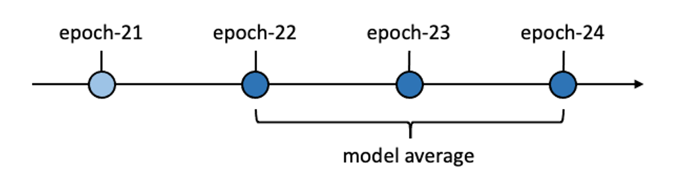
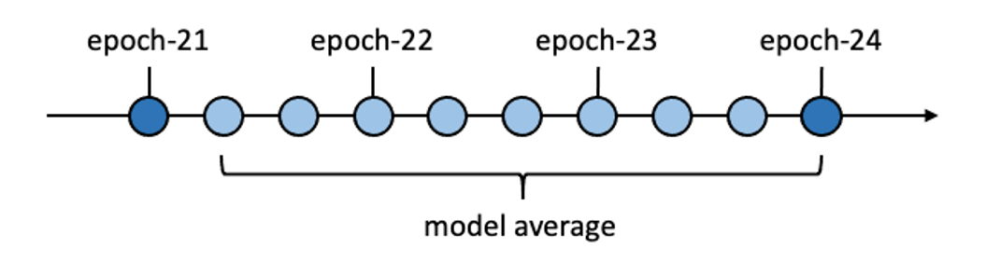

# 新一代 Kaldi 中的模型平均

> 本文介绍新一代 Kaldi 中模型平均：
>
> 相关代码：https://github.com/k2-fsa/icefall/tree/master/egs/librispeech/ASR/pruned_transducer_stateless4

## 1. 原来的模型平均策略

使用过 icefall 的用户可能会注意到，使用 `decode.py` 解码时，除了需要提供参数 `--epoch` 来指定要读取的模型外，还会搭配参数 `--avg` 来实现模型平均。

在 icefall 的训练过程中，我们会在每个 epoch 结束时保存当前的模型，为文件 `epoch-*.pt` 。这么做一方面是为了方便用户在训练中断时继续训练，另一方面则是为了在解码时实现模型平均。

例如，使用 `decode.py` 解码时，指定参数 `--epoch 24 --avg 3`, 我们会读取文件 `epoch-24.pt`、 `epoch-23.pt`、`epoch-23.pt` 所保存的模型，利用它们求得一个平均模型来解码，如下图所示。

### 模型平均的目的

在使用随机梯度下降算法优化模型参数的过程中，得到的每个模型，可以看作是在参数空间中，朝着优化目标函数的方向探索的不同采样点。

在训练的后期，模型参数采样点会在最优点附近浮动。通过在参数空间，对这些在最优点附近浮动的采样点求均值，可以得到一个噪声（随机性）更低的模型，即更加接近最优点的模型。

### 存在的局限性

* 每个 epoch 采样一个模型，中间经过了很多个 batch，这种采样方式可能过于稀疏。
* 如果每个 epoch 对训练数据的遍历顺序不是随机的，那么每个 epoch 结束时所保存的模型采样点，可能会“记住”了数据遍历的顺序。使用这些采样点来进行模型平均，显然不是我们所期望的。

### 潜在的解决方案

为了解决上述问题，我们可以缩小采样间隔，实现更加**密集**的模型平均，例如每隔 100 个 batch 采样一个模型。这种做法的好处在于：

* 通过使用更密集的采样点，可以得到一个**噪声（随机性）更低**的平均模型。
* 用来作模型平均的采样点，覆盖了每个 epoch 中数据遍历的不同阶段，这样就不用担心前面提到的模型可能会“记住”了数据遍历顺序的问题。

然而，这种做法可能会占用更多的存储空间和 I/O ：
* 训练时，我们需要保存大量的模型，例如每 100 个 batch 保存一个；
* 解码时，为了实现模型平均，我们需要读取大量的模型文件。

## 2. 改进后的模型平均策略

为了解决上述的问题，icefall 中采用了一种巧妙的策略，来实现更加密集的模型平均。

### 训练中维护平均模型 $\text{model_avg}$

在训练的过程中，除了当前的模型 $\text{model}$ 外，还维护着一个平均模型 $\text{model_avg}$。$\text{model_avg}$ 表示从训练开始，每隔 $p$ 个 batch 作一个模型采样，并所得到的样本集合取均值的结果。

假设从训练开始，到当前为止已经采样 $n$ 次，此时所维护的平均模型 $\text{model_avg}_{[1,n]}$ 为：
$$
\text{model_avg}_{[1,n]} = \frac{1}{n}\sum_{j \in S} \text{model}_j
$$
式中，$S = \{ p \times i | i = 1,2,\dots,n\}$ 为采样的 batch 下标集合。

在进行第 $n+1$ 次采样时，我们结合当前的模型 $\text{model}$，更新平均模型，得到 $\text{model_avg}'$:
$$
\text{model_avg}' = \text{model_avg} \times \frac{n}{n+1} + \text{model}_{} \times \frac{1}{n+1}
$$

感兴趣的同学可以简单证明，更新后的平均模型 $\text{model_avg}'$，就是 batch 下标集合 $S' = \{ p \times i | i = 1,2,\dots,n+1 \}$ 所对应的模型采样点的均值，即 $\text{model_avg}_{[1,n+1]}$：

$$
\text{model_avg}' = \text{model_avg}_{[1,n+1]} = \frac{1}{n+1}\sum_{j \in S'} \text{model}_j
$$

在 icefall 实现中，$p$ 对应的是 `train.py` 中的参数 `--average-period`，其默认值为 100，即每 100 个 batch 作一次采样。

在每个 epoch 结束时，我们在文件 `epoch-*.pt`中，除了保存当前的模型之外，也会保存当前所维护的平均模型 $\text{model_avg}$。

* 注意，我们并没有每隔 100 个 batch 保存一个模型，保存的文件 `epoch-*.pt`个数并没有增多。

### 解码时利用平均模型 $\text{model_avg}$

解码时，我们可以基于训练过程中所保存的平均模型 $\text{model_avg}$，以一种节省 I/O 的方式，实现模型平均。

假设 epoch-$\text{start}$ 和 epoch-$\text{end}$ 分别表示我们保存的两个模型， $\text{start} \le \text{end}$：
* epoch-$\text{start}$ 保存着平均模型 $\text{model_avg}_{[1,p]}$，其经过了 $p$ 次采样；
* epoch-$\text{end}$ 保存着平均模型 $\text{model_avg}_{[1,q]}$，其经过了 $q$ 次采样。

为了获取在 epoch-$\text{start}$ 和 epoch-$\text{end}$ 中间的平均模型，即第 $p+1$ 次采样到第 $q$ 次采样之间样本点的均值 $\text{model_avg}_{[p+1,q]}$，
我们只需要根据 $\text{model_avg}_{[1,p]}$ 和 $\text{model_avg}_{[1,q]}$ 两个模型计算得到：
$$
\text{model_avg}_{[p+1,q]} = \frac{1}{q-p}(\text{model_avg}_{[1,q]} \times q - \text{model_avg}_{[1,p]} \times p)
$$

例如，使用 `decode.py` 解码时，指定参数 `--epoch 24 --avg 3 --use-averaged-model`, 我们会读取文件 `epoch-24.pt` 和 `epoch-21.pt` 中分别保存的平均模型 $\text{model_avg}$，利用这两个模型，求得在这个**区间**内的每隔 100 个 batch 作模型采样的平均模型，并依靠该平均模型来解码，如下图所示：

如此一来，解码时我们只需要加载两个模型，便能获得采样点**更加密集**，即噪声（随机性）更低的平均模型。

## 实验结果

我们在 `full librispeech` 数据集上使用 [Reworked Conformer](https://mp.weixin.qq.com/s/2WrEh3wHzYE6TCKuw_laLw) 训练 20 个 epoch，然后比较以下三种方式，在 `test-clean` 和 `test-other` 两个测试集上，对解码结果的影响：

* **epoch-20**：使用 epoch-20 的模型解码，即指定参数 `--epoch 20`；
* **epoch-20-avg-5**：使用 epoch-16 ～ epoch 20 这个五个模型的平均模型解码，即指定参数 `--epoch 20 --avg 5`；
* **epoch-20-avg-5-use-averaged-model**：使用 epoch-15 ～ epoch 20 这个区间内每隔 100 个 batch 作采样的平均模型解码，即指定参数 `--epoch 20 --avg 5 --use-averaged-model`。

| Decoding model | WER on test-clean (%) | WER on test-other (%) |
| --- | --- | --- |
| epoch-20 | 3.34    |  8.18   |
| epoch-20-avg-5 |  2.93  | 7.1 |
| epoch-20-avg-5-use-averaged-model  |  **2.82**   |  **7.0**  |

由表可以看出，相比较于使用原来的模型平均策略（每个epoch采样一次），使用改进后的模型平均策略（每隔 100 个 batch 采样一次），可以在识别性能上获得比只用单个模型更好的性能提升。

> 注意：本文没有讨论文件 `checkpoint-*.pt`，与文件 `epoch-*.pt` 的区别在于，它是默认每 8000 个 batch 保存一个文件。上述的策略同样应用于文件 `checkpoint-*.pt`。
