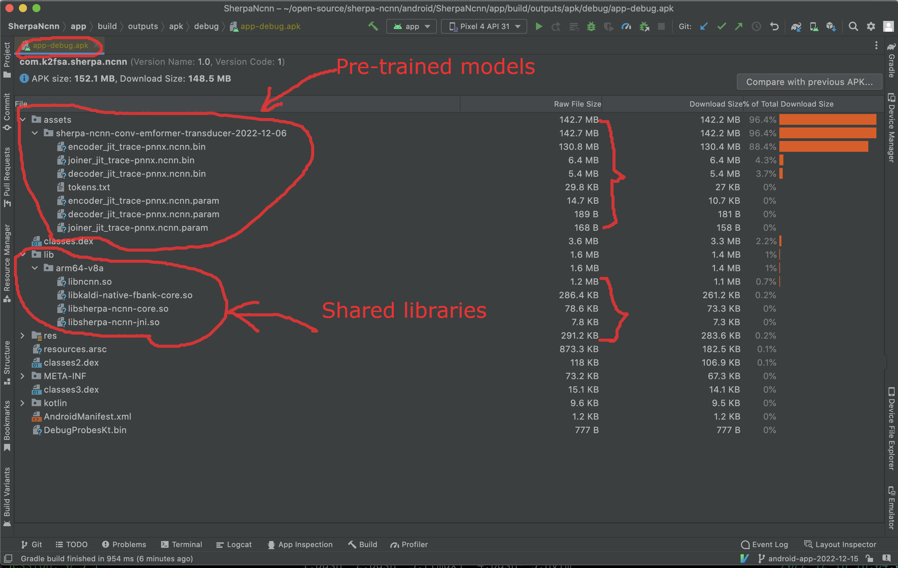

# 在安卓上使用新一代 Kaldi 进行实时语音识别

## 简介

本文属于演示性质。希望通过四个视频向大家展示我们最近的进展：
支持在手机上使用新一代 ``Kaldi`` 进行实时的语音识别。

具体的实现细节，比如模型训练、模型转换、如何构建一个安卓 ``app`` 等，
请参考如下文档：

https://k2-fsa.github.io/sherpa/ncnn/index.html

> 注 1：所有的代码和模型，我们都开源了出来。希望对大家有帮助的同时，
> 也能吸引更多的人参与进来，让我们能携手一起开发。

> 注 2：所有识别都在本地完成，不需要网络连接。

下图展示了我们构建的 ``apk`` 所包含的详细内容。

大家可以看到，我们的 `runtime` （动态库）合计不超过 ``1.6 MB``。
``apk`` 中绝大部分都是由预训练模型组成。

如果大家也想在自己手机上尝试本文的视频，可以从下面两个
地址下载我们提供的 ``apk`` 安装包：

### 1. CPU 版本，支持 Android >= 5.0

https://huggingface.co/csukuangfj/sherpa-ncnn-apk/resolve/main/2022-12-17-mixed-english-chinese-sherpa-ncnn.apk

### 2. GPU 版本，支持 Android >= 7.0 (使用 Vulkan)

https://huggingface.co/csukuangfj/sherpa-ncnn-apk/resolve/main/2022-12-17-with-vulkan-gpu-mixed-english-chinese-sherpa-ncnn.apk

## 演示

下面我们通过四个视频，向大家展示在安卓手机上使用新一代 ``Kaldi`` 进行
实时语音识别。

### 1. 纯中文（不带背景噪声）

### 2. 中文 + 英文（不带背景噪声）

### 3. 中文 （小猪佩奇节选，带背景噪声）

### 4. 中文诗词 （带背景音乐）

## 总结

本文向大家展示了在安卓上使用新一代 ``Kaldi`` 进行实时语音识别。我们开源了
所有的代码和模型。

关于移动端的语音识别，我们还有以下若干未完成的事项：

- （1）使用 [ncnn][ncnn] 的 ``int8`` 进行计算
- （2）支持更多的平台，如 ``iOS`` 等
- （3）在不降低准确度的情况下，训练更小、速度更快的模型
- ... ...

如果你也感兴趣，欢迎你提交 ``pull-request``。

[ncnn]: https://github.com/tencent/ncnn
