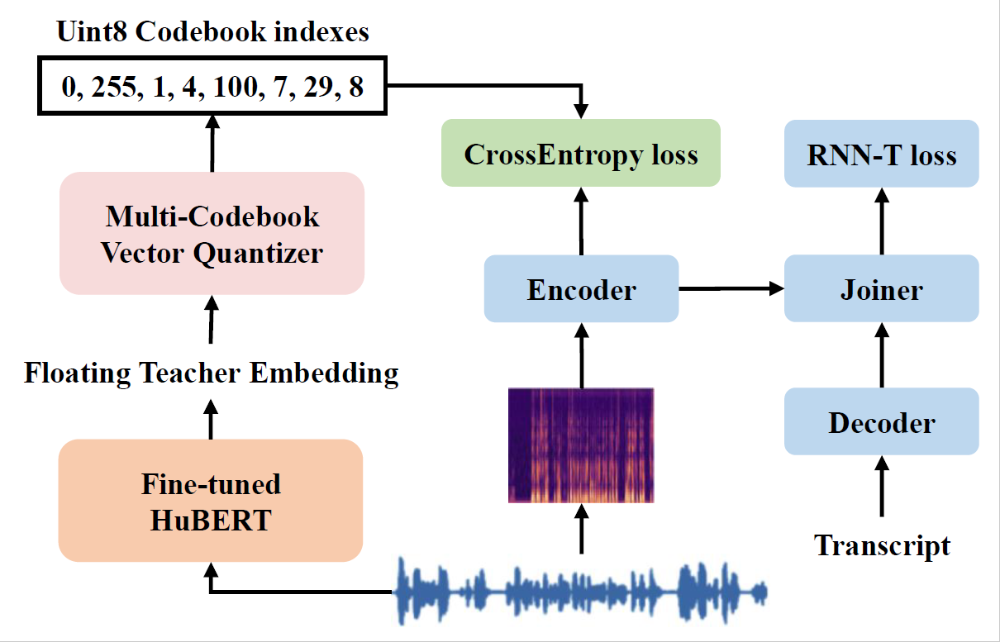
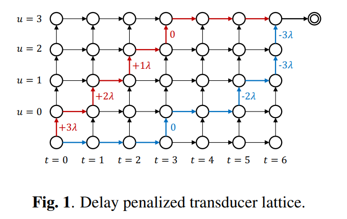

新一代Kaldi技术总结：

好久不见，甚是想念，不知道各位春节假期都过得怎么样呀~我们k2（兔）团队在这里给大家拜个晚年，祝大家新春快乐，万事胜意，paper高中，事业高升！今天小编给大家做一个总结，带大家回顾一下过去一年中新一代Kaldi团队的技术点和大事件。

## 1. 技术创新

### 1.1 Pruned RNN-T loss
该项工作是新一代Kaldi针对RNN-T损失函数的创新性改进。原始的RNN-T损失函数在处理长文本或者长语音的时候显存占用较大，训练时间较长。对此，我们提出对RNN-T的log-probability lattice进行裁剪，能够在不损失训练精度的前提下大幅缩短RNN-T损失函数的计算时间。该[工作](https://arxiv.org/abs/2206.13236)已经被Interspeech2022收录，我们也撰写了多篇文章详细介绍其中的细节:
- 初探Pruned RNN-T：[多快好省的 RNN-T 训练](https://mp.weixin.qq.com/s/bgJHwHp0PyFy0pWGVWvv0w)
- 细聊Pruned RNN-T：[Pruned RNN-T 何以又快又好](https://mp.weixin.qq.com/s/M7Oz5b0LbtIxm0PfVb5iww)

欢迎大家阅读交流！

### 1.2 RNN-T的快速GPU解码

在该项工作中我们在 GPU 上实现了高效的 FSA 解码，为此我们对 RNN-T 做了一些改造，首先我们在 RNN-T 中使用了无状态的 decoder 网络，使用有限的left context；另外，我们在解码时限制每一帧语音只能输出一个 symbol。在这两个前提下，我们基于 `k2` 中的 RaggedTensor 实现了帧同步的 beam search 解码。这可能是现今唯一既能使用 FSA 又能运行于 GPU 的解码方法，我们测试发现使用 80M 的模型在英伟达 V100 显卡上能并行跑 200 路以上的语音，LibriSpeech 数据集上的解码实时率低至 0.0025。该[工作](https://arxiv.org/abs/2211.00484 "工作")已经提交至ICASSP2023，`icefall`中的`fast_beam_search`实现了该种解码办法，欢迎大家尝试！


### 1.3 多码本量化索引的知识蒸馏

知识蒸馏是常见的提升模型表现的办法。针对传统知识蒸馏框架中的训练效率和教师标签存储成本的问题，新一代Kaldi团队创新性的提出了基于多码本量化索引的知识蒸馏。该框架的示意图。该办法能够在几乎不影响知识蒸馏的效果的前提下，实现对教师标签上百倍的压缩，有效的解决了传统知识蒸馏办法在大数据集下面临的困境。该[工作](https://arxiv.org/abs/2211.00508 "工作")目前也已经提交至ICASSP2023，我们也撰写了一篇详细的[文章](https://mp.weixin.qq.com/s/XIg8cY82KtoZ6rW-FdVqEQ)介绍标签压缩的算法（写得特别好，小编强烈推荐！），欢迎大家阅读！


### 1.4 RNN-T和CTC的低延时训练
时延是流式ASR模型的一项重要指标。新一代Kaldi团队针对流式RNN-T模型的时延惩罚做了大量研究，最终探索出一条简单有效的时延惩罚策略。根据lattice中不同通路的产生的时延，对RNN-T的log-probability lattice进行简单的修正，让模型更倾向于学习时延更短的通路。通过控制时延惩罚的参数，我们可以精准的控制时延和模型准确率之间的trade-off。该框架的示意图该工作已经提交ICASSP2023，论文的链接在[这里](https://arxiv.org/abs/2211.00490 "这里")，欢迎大家阅读！

在CTC模型中，我们也借鉴了该思路实现了一套时延惩罚策略。有兴趣的读者请移步[这里](https://mp.weixin.qq.com/s/zOBbLeqKASLE9cvOYwCM4w)，我们对RNN-T和CTC中的时延惩罚策略都做了详细的介绍。

### 1.5 Zipformer
Zipformer模型是新一代Kaldi团队提出的新型声学建模架构。针对传统Conformer的诸多细节做了大幅度改动，包括
  - 优化器（ScaledAdam）
  - 时间维度U-Net（通过降采样和升采样大幅降低计算量）
  - 注意力权重复用，减少计算量
  - 多个创新性的子模块
  - ...
  
目前Zipformer模型已经在诸多测试集上取得了出色的识别准确率，代码也已经合并在[`icefall`](https://github.com/k2-fsa/icefall/tree/master/egs/librispeech/ASR/pruned_transducer_stateless7 "`icefall`")的中，欢迎大家尝试。再告诉大家一个小秘密，Dan哥现在正在对Zipformer的诸多子模块做进一步优化，预计在不远的将来会有新一版的Zipformer和大家见面，敬请期待！

### 1.6 Small tricks

除了上述的几项，我们还做了如下的一些工作：
  - 升点小技巧之[模型平均算法](https://mp.weixin.qq.com/s/8BOjpCe9_--oWcmLlKoTBA)，简单有效的ensemble技巧。通过维护一个`averaged_model`变量，高效的实现更细粒度的模型平均；
  - 升点小技巧之[语言模型融合](https://mp.weixin.qq.com/s/MkvKF5JJch3DT2RA87v9lQ "语言模型融合")，让你的模型越来越好；
  - 训练小助手之[Random Combiner](https://mp.weixin.qq.com/s/KGLNzCRtkcoZuCmV0ozUAQ)，有效训练更深的模型。；
  - 训练小助手之[Gradient Filter](https://mp.weixin.qq.com/s/h-8rg9WFOe669TmFMOXTpQ)，实时追踪并且剔除可能导致梯度爆炸的坏样本，让你的LSTM模型更加稳定；
  - 提速小助手之[跳帧Blank-skipping](https://github.com/k2-fsa/icefall/tree/master/egs/librispeech/ASR/pruned_transducer_stateless7_ctc_bs "跳帧Blank-skipping")。在解码RNN-T模型时，利用CTC的概率输出跳过输出Blank的帧，大幅提升解码的效率（详见[原论文](https://arxiv.org/abs/2210.16481 "原论文")）。该方案我们在icefall中也有实现，欢迎大家尝试。
  - ...

欢迎大家阅读（小编注：简单有效，说不定就能用在自己的模型上了呢！）

## 2. 模型部署

### 2.1 Sherpa

[sherpa](https://github.com/k2-fsa/sherpa "sherpa")是新一代Kaldi团队推出的服务端ASR模型部署方案。包含了特征提取，神经网络计算和解码三个部分，并且提供了Python接口方便使用。部署完成后，只需要一个浏览器，你就可以流畅体验`icefall`中提供的诸多自动语音识别模型。使用教程详见如下的[文章](https://mp.weixin.qq.com/s/w1qrKw43eOh2qszdHDLaFw).

### 2.1 Sherpa-ncnn

如果你在寻找一个适合于移动端或者嵌入式端的部署方案，那不妨试试`sherpa-ncnn`。[Sherpa-ncnn](https://github.com/k2-fsa/sherpa-ncnn "Sherpa-ncnn")是新一代Kaldi团队在去年推出的**安装便捷**，支持**实时**语音识别的**Python**包。仅需一行代码
```
pip install sherpa-ncnn
```
便可以体验新一代Kaldi支持的诸多语音识别模型。`sherpa-ncnn`现在已经支持Linux，Windows，macOS，Android等常见平台。在嵌入式平台上，`sherpa-ncnn`也实现了实时语音识别。我们还实现了基于`ncnn`的int8模型量化，能够进一步压缩模型大小，提升推理速度。更多细节欢迎大家阅读这几篇文章：
  - `sherpa-ncnn`[介绍](https://mp.weixin.qq.com/s/K_HNMSz-Ri297HDuz5Yqlg);
  - 移动端使用[案例](https://mp.weixin.qq.com/s/ZqhnthP3znBE21GiBLfhYQ);
  - 嵌入式端使用[案例](https://mp.weixin.qq.com/s/r4nGu04o1sjdFZt_vYbUAA);
  
每篇都干货满满，并且展示了诸多demo！
（小编注：军哥手把手教你，零基础教你玩转语音识别，一看就会！）


## 3. 更多的recipe和模型

过去的一年中，我们在`icefall`中增添了不少新的recipe，涵盖了诸多公开数据集其中包括：
  - 中文数据集：[aishell2](https://github.com/k2-fsa/icefall/tree/master/egs/aishell2/ASR "aishell2"), [aishell4](https://github.com/k2-fsa/icefall/tree/master/egs/aishell4/ASR "aishell4"), [wenetspeech](https://github.com/k2-fsa/icefall/tree/master/egs/wenetspeech/ASR "wenetspeech");
  - 英文数据集：[gigaspeech](https://github.com/k2-fsa/icefall/tree/master/egs/gigaspeech/ASR "gigaspeech"),[tedlium3](https://github.com/k2-fsa/icefall/tree/master/egs/tedlium3/ASR "tedlium3");
  - 中英文数据集：[tal_csasr](https://github.com/k2-fsa/icefall/tree/master/egs/tal_csasr/ASR "tal_csasr")
  - 藏语数据集：[xbmu_amdo31](https://github.com/k2-fsa/icefall/tree/master/egs/xbmu_amdo31/ASR "xbmu_amdo31")
  
我们还新增支持了多种模型结构，包括
  - [Reworked Conformer](https://github.com/k2-fsa/icefall/tree/master/egs/librispeech/ASR/pruned_transducer_stateless5 "Reworked Conformer")，是新一代Kaldi提出的改进版Conformer模型；
  - [LSTM](https://github.com/k2-fsa/icefall/tree/master/egs/librispeech/ASR/lstm_transducer_stateless2 "LSTM")，使用了LSTM模型作为Encoder，并加入了诸多改动提升训练的稳定性；
  - [Emformer](https://arxiv.org/abs/2010.10759 "Emformer")，是facebook提出的低内存占用的流式模型。`icefall`中的实现详见[这里](https://github.com/k2-fsa/icefall/tree/master/egs/librispeech/ASR/conv_emformer_transducer_stateless2 "这里")；
  - [Zipformer](https://github.com/k2-fsa/icefall/tree/master/egs/librispeech/ASR/pruned_transducer_stateless7 "Zipformer")，小编在上文已经介绍过了，这里不做重复啦；
  

温故而知新，以上就是对过去一年新一代Kaldi团队的创新技术点和工作进展的一个简单总结。新的一年，我们会继续专注于技术，同时聆听新一代Kaldi用户社群的需求，为大家带来更多更好的技术！


