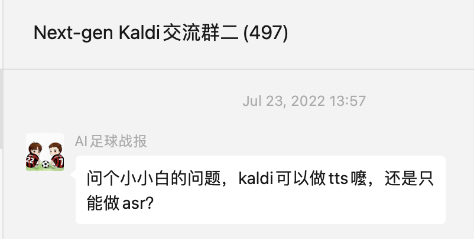
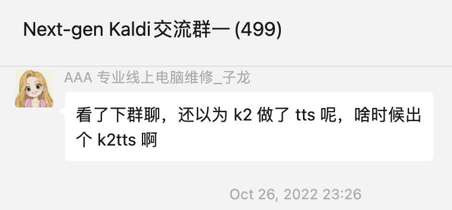
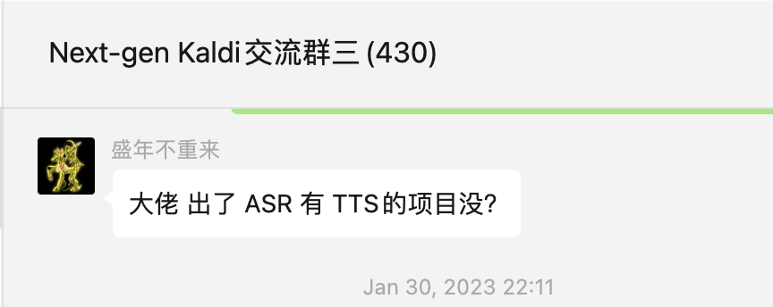
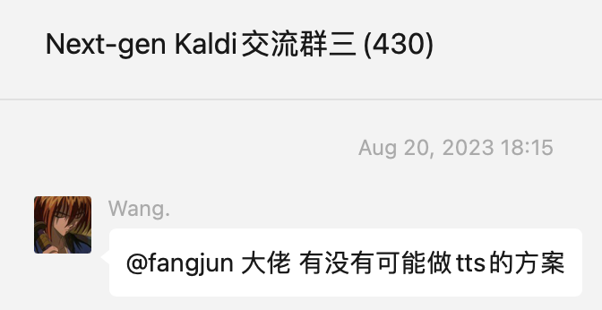
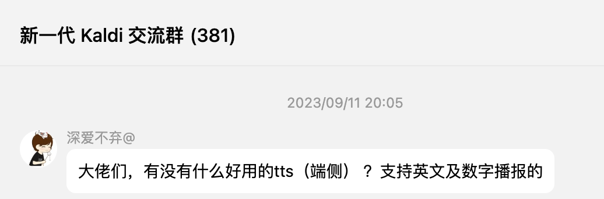
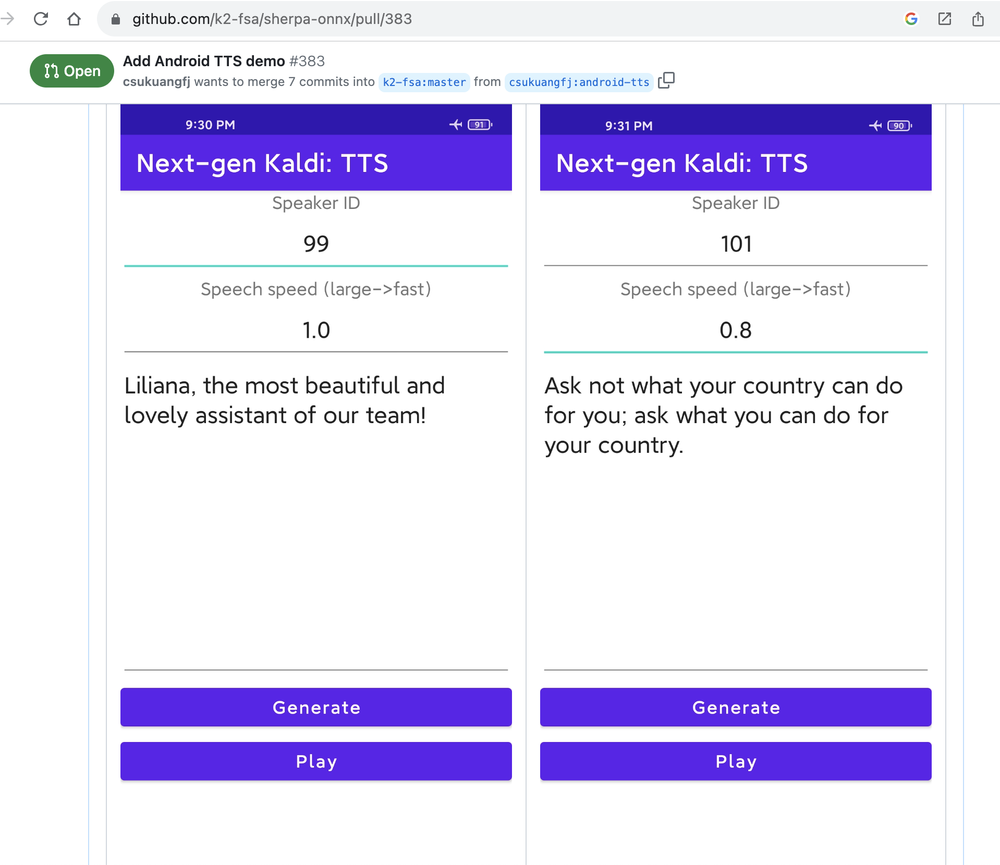
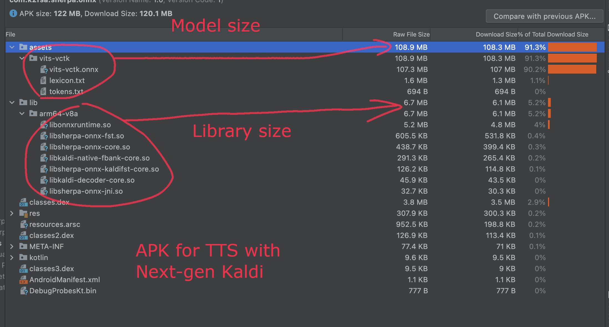
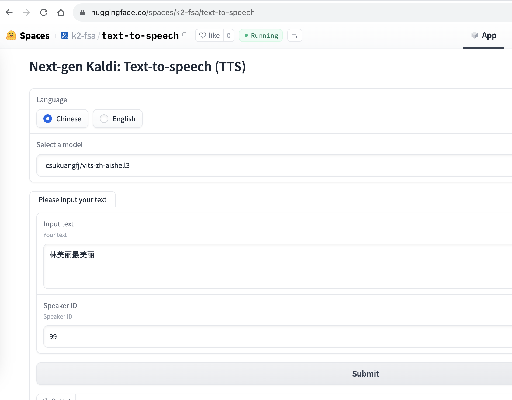
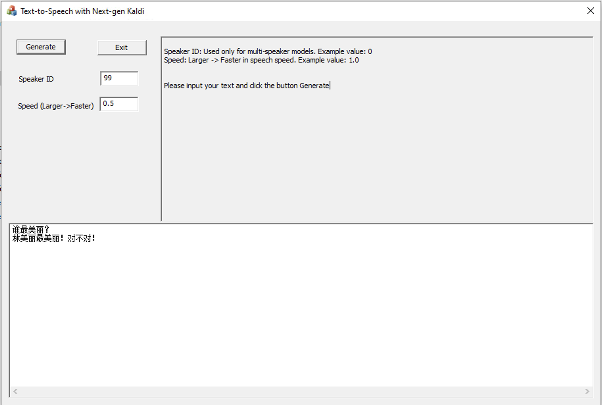

# 新一代 Kaldi: TTS Runtime 来啦

## 简介

从去年 7 月份开始，新一代 ``Kaldi`` 交流群里面不断有同学询问我们是否支持 ``TTS`` (``text-to-speech``)。

|2022.07.23|2022.10.26|2023.01.30|2023.08.20|2023.09.11|
|---|---|---|---|---|
||||||

经过近**两周**的努力，现在我们终于支持 TTS 啦！

本文向大家介绍如何在新一代 ``Kaldi``的部署框架 [sherpa-onnx][sherpa-onnx]中使用 ``TTS``。

> 注：[sherpa-onnx][sherpa-onnx] 提供的是一个``TTS runtime``, 即部署环境。它并不支持模型训练。
> 本文使用的测试模型，都是来源于网上开源的 [VITS][VITS] 预训练模型。
>
> 我们提供了 ``ONNX`` 导出的支持。如果你也有 ``VITS`` 预训练模型，欢迎尝试使用
``sherpa-onnx`` 进行部署。

## 安装

最快速的安装方式是：

```
pip install sherpa-onnx
```

上述命令支持如下平台：

- Windows (x86, x64)
- Linux (x64, arm64, arm)
- macOS (x64, arm64)

如果你希望从源码编译，或者你希望使用其他语言的 API， 比如 C/C++/Go/Kotlin/C#/Swift 等，
请参考文档

https://k2-fsa.github.io/sherpa/onnx/install/index.html

> 注：``Linux arm64/arm``  的意思是我们也支持嵌入式 ``Linux``,  比如树莓派。

## 下载模型

目前我们从网上找了 3 个开源的 ``VITS`` 预训练模型：

|训练数据集| 支持的语言|是否支持多发音人|
|---|---|---|
|[LJ Speech](https://keithito.com/LJ-Speech-Dataset/)| 英语| 否|
|[VCTK](https://datashare.ed.ac.uk/handle/10283/2950)|英语|是|
|[aishell3](https://www.openslr.org/93/)|中文|是|

文档 https://k2-fsa.github.io/sherpa/onnx/tts/pretrained_models/index.html
提供了详细的下载方法。

下面两个表格总结了本文用到的模型文件下载链接。

### 英文多说话人模型

|模型文件名|下载链接|
|---|---|
|vits-vctk.onnx|https://huggingface.co/csukuangfj/vits-vctk/resolve/main/vits-vctk.onnx|
|lexicon.txt|https://huggingface.co/csukuangfj/vits-vctk/resolve/main/lexicon.txt|
|tokens.txt|https://huggingface.co/csukuangfj/vits-vctk/resolve/main/tokens.txt|

### 中文多说话人模型

|模型文件名|下载链接|
|---|---|
|vits-aishell3.onnx|https://huggingface.co/csukuangfj/vits-zh-aishell3/resolve/main/vits-aishell3.onnx|
|lexicon.txt|https://huggingface.co/csukuangfj/vits-zh-aishell3/resolve/main/lexicon.txt|
|tokens.txt|https://huggingface.co/csukuangfj/vits-zh-aishell3/resolve/main/tokens.txt|

## 使用

开始使用之前，我们还需要下载最后一个 ``Python`` 文件:

https://github.com/k2-fsa/sherpa-onnx/blob/master/python-api-examples/offline-tts.py

### 中文转语音

```
# 使用上面下载的 offline-tts.py 和 中文多说话人模型文件

python3 ./offline-tts.py \
  --vits-model=./vits-aishell3.onnx \
  --vits-lexicon=./lexicon.txt \
  --vits-tokens=./tokens.txt \
  --sid=10 \
  --output-filename=./liliana-10.wav \
  "林美丽最美丽、最漂亮、最可爱！"
```
``--sid=10`` 的意思是使用第10个说话人的声音。 上面的命令会生成一个文件 ``liliana-10.wav``。

如果我们想换个不同的说话人，比如第 30 个说话人，可以使用如下语句：

```
python3 ./offline-tts.py \
  --vits-model=./vits-aishell3.onnx \
  --vits-lexicon=./lexicon.txt \
  --vits-tokens=./tokens.txt \
  --sid=30 \
  --output-filename=./liliana-30.wav \
  "林美丽最美丽、最漂亮、最可爱！"
```

我们也可以改变速度，比如使用 2 倍速 (需要使用参数 ``--speed=2.0``)

```
python3 ./offline-tts.py \
  --vits-model=./vits-aishell3.onnx \
  --vits-lexicon=./lexicon.txt \
  --vits-tokens=./tokens.txt \
  --sid=30 \
  --speed=2.0 \
  --output-filename=./liliana-30-2x.wav \
  "林美丽最美丽、最漂亮、最可爱！"
```

如果需要 0.8 倍速，则可以用：

```
python3 ./offline-tts.py \
  --vits-model=./vits-aishell3.onnx \
  --vits-lexicon=./lexicon.txt \
  --vits-tokens=./tokens.txt \
  --sid=30 \
  --speed=0.8 \
  --output-filename=./liliana-30-0.8x.wav \
  "林美丽最美丽、最漂亮、最可爱！"
```

生成的音频文件如下表所示:

|liliana-10.wav|[./audio/tts/liliana-10.wav](./audio/tts/liliana-10.wav)|
|---|---|
|liliana-30.wav|[./audio/tts/liliana-30.wav](./audio/tts/liliana-30.wav)|
|liliana-30-2x.wav|[./audio/tts/liliana-30-2x.wav](./audio/tts/liliana-30-2x.wav)|
|liliana-30-0.8x.wav|[./audio/tts/liliana-30-0.8x.wav](./audio/tts/liliana-30-0.8x.wav)|

> 注：本文使用的模型为网上开源的预训练模型。

### 英文转语音

使用方法和中文转语音是类似的，只需要替换相关的模型文件：

```
# 使用上面下载 offline-tts.py 和 英文多说话人模型文件

python3 ./offline-tts.py \
  --vits-model=./vits-vctk.onnx \
  --vits-lexicon=./lexicon.txt \
  --vits-tokens=./tokens.txt \
  --sid=0 \
  --output-filename=./kennedy-0.wav \
  "Ask not what your country can do for you; ask what you can do for your country."
```

```
python3 ./offline-tts.py \
  --vits-model=./vits-vctk.onnx \
  --vits-lexicon=./lexicon.txt \
  --vits-tokens=./tokens.txt \
  --sid=99 \
  --output-filename=./armstrong-99.wav \
  "That's one small step for a man, a giant leap for mankind."
```

生成的音频文件如下表所示:

|kennedy-0.wav|[./audio/tts/kennedy-0.wav](./audio/tts/kennedy-0.wav)|
|---|---|
|armstrong-99.wav|[./audio/tts/armstrong-99.wav](./audio/tts/armstrong-99.wav)|

> 注：本文使用的模型为网上开源的预训练模型。

## 体验

我们提供三种方式供大家体验 ``sherpa-onnx`` 里的文字转语音。

### Android APK

我们提供预编译的 Android APK 供大家下载。

|语言|APK 下载地址|
|---|---|
|中文|https://github.com/k2-fsa/sherpa-onnx/releases/download/v1.8.4/sherpa-onnx-1.8.4-arm64-v8a-zh-tts-multi-speaker-aishell3.apk|
|英文|https://github.com/k2-fsa/sherpa-onnx/releases/download/v1.8.4/sherpa-onnx-1.8.4-arm64-v8a-en-tts-multi-speaker-vctk.apk|

英文 APK 运行截图如下图所示：



APK 文件分析截图如下图所示：



### 在线体验

我们提供一个 ``huggingface space``，供大家在线体验。

体验地址如下：

https://huggingface.co/spaces/k2-fsa/text-to-speech

运行截图如下：



### Windows 可执行程序

我们也提供一个单一的 Windows exe 程序，双击就能运行，无须安装。

> 注：你仍然需要自己单独下载模型文件。

``exe`` 下载地址如下：

https://github.com/k2-fsa/sherpa-onnx/releases/download/v1.8.4/sherpa-onnx-non-streaming-tts-v1.8.4.exe

运行截图如下：




## 总结

本文向大家介绍了如何使用 ``sherpa-onnx`` 把文字转成语音。目前使用的模型源于网上开源的
预训练模型，后续我们也会在 [icefall](https://github.com/k2-fsa/icefall) 中支持模型训练的功能。


[sherpa-onnx]: https://github.com/k2-fsa/sherpa-onnx
[VITS]: https://github.com/jaywalnut310/vits
