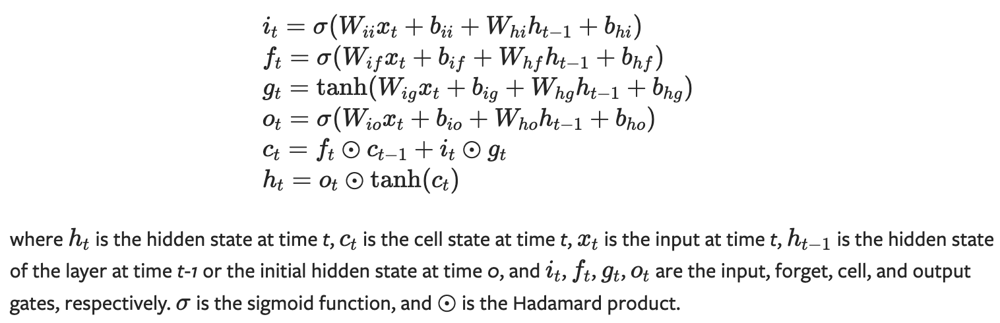
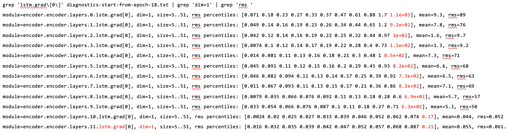
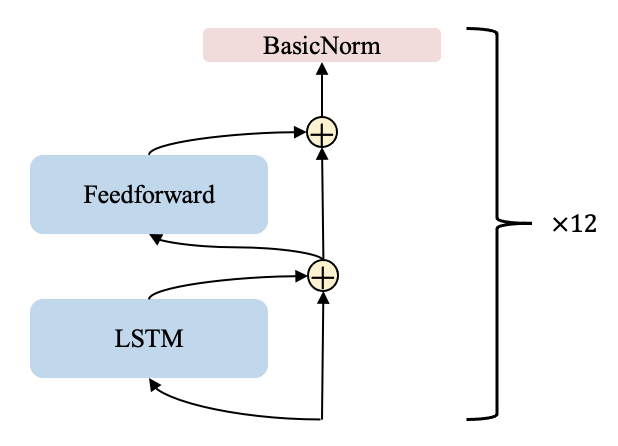

# 新一代 Kaldi 中的 LSTM GradientFilter

> 本文介绍新一代 Kaldi 中的 LSTM GradientFilter：
>
> 相关代码：https://github.com/k2-fsa/icefall/blob/master/egs/librispeech/ASR/pruned_transducer_stateless2/scaling.py#L115

## LSTM 梯度问题



我们先通过上图简单回顾下 LSTM cell 的内部结构和运算机制。作为 RNN 的变种之一，
LSTM 旨在解决 RNN 存在的梯度消失或梯度爆炸的问题。

虽然在大多数情况下，LSTM 可以解决梯度问题。然而，如果矩阵 $W$ 的值非常大，梯度爆炸问题
仍然会发生，原因在于：在反向传播中，梯度会与矩阵 $W$ 相乘；随着序列的长度增大，
相乘次数越多，梯度会无限制地随之增大。

我们在 icefall 的 PR （https://github.com/k2-fsa/icefall/pull/558
）中讨论了训练 LSTM 模型时遇到的梯度问题。通过使用 icefall 中提供的模型分析工具（https://github.com/k2-fsa/icefall/blob/master/icefall/diagnostics.py），发现在第 10
层发生了梯度爆炸，由于梯度的反向传播，导致前面的层输出值对应的梯度都超过了正常范围。



我们使用的 LSTM 模型结构相对简单，包括 12 层的 encoder-layer。
如下图所示，每个 encoder-layer 包括一个 ScaledLSTM、一个 ScaledFeedForward 和 一个 BasicNorm。



感兴趣的同学可以查看关于 LSTM 的 recipe 相关代码:
https://github.com/k2-fsa/icefall/blob/master/egs/librispeech/ASR/lstm_transducer_stateless3/lstm.py

## Pytorch 中的 clip_grad_norm_

尽管 Pytorch 中的梯度裁剪函数 `torch.nn.utils.clip_grad_norm_` 可以在一定程度上解决梯度爆炸的问题，然而，该函数作用于对整个模型梯度反向传播结束之后，核心代码如下所示。

```
# see https://github.com/pytorch/pytorch/blob/435e78e5237d9fb3e433fff6ce028569db937264/torch/nn/utils/clip_grad.py#L10
total_norm = torch.norm(
  torch.stack(
    [torch.norm(p.grad.detach(), norm_type).to(device) for p in parameters]
  ), norm_type
)
clip_coef = max_norm / (total_norm + 1e-6)
clip_coef_clamped = torch.clamp(clip_coef, max=1.0)
for p in parameters:
    p.grad.detach().mul_(clip_coef_clamped.to(p.grad.device))
```

阅读代码，可发现其潜在的问题为：
* 裁剪之后，那些发生爆炸的模块会占主导，其它模块的梯度将变得特别小；
* 爆炸的梯度向前面层反向传播没有太大意义。

## GradientFilter

我们希望在梯度的反向传播过程中，及时裁剪发生爆炸的梯度，而不是在整个模型的梯度反向传播完成之后。因此，我们在 icefall 实现了 用于训练 LSTM 的 GradientFilter 模块。

该模块基于 torch.autograd.Function 实现，作用于每个 LSTM 层的内部，如：

```
# see https://github.com/k2-fsa/icefall/blob/9b671e1c21c190f68183f05d33df1c134079ca18/egs/librispeech/ASR/pruned_transducer_stateless2/scaling.py#L594
input, *flat_weights = self.grad_filter(input, *flat_weights)
```

如下面代码块所示，GradientFilter 在前向计算过程不进行任何操作，在反向传播过程中以 mask 的形式：
* 过滤每个 batch 中 发生梯度爆炸的那些元素（序列）；
* 并根据梯度裁剪的程度，对应地放缩 LSTM 模块参数的梯度。

```
# see https://github.com/k2-fsa/icefall/blob/9b671e1c21c190f68183f05d33df1c134079ca18/egs/librispeech/ASR/pruned_transducer_stateless2/scaling.py#L115
eps = 1.0e-20
dim = ctx.batch_dim
norm_dims = [d for d in range(x_grad.ndim) if d != dim]
norm_of_batch = (x_grad ** 2).mean(dim=norm_dims, keepdim=True).sqrt()
median_norm = norm_of_batch.median()

# filter gradients of batch elements
cutoff = median_norm * ctx.threshold
inv_mask = (cutoff + norm_of_batch) / (cutoff + eps)
mask = 1.0 / (inv_mask + eps)
x_grad = x_grad * mask

# filter gradients of module parameters
avg_mask = 1.0 / (inv_mask.mean() + eps)
param_grads = [avg_mask * g for g in param_grads]
```

## 实验结果

下面展示了 LSTM 模型在 Full LibriSpeech 数据集上训练了 40 个 epoch，使用不同解码方法时，在 test-clean & test-other 上的 WER：
| epoch-40-avg-15 | greedy search | modified beam search | fast beam search |
|-------------------|----------------|----------------------|------------------|
| baseline | 3.79 & 9.71 | 3.66 & 9.43 | 3.73 & 9.6 |
| with the gradient filter | 3.66 & 9.51 | 3.55 & 9.28 | 3.55 & 9.33 |

可以发现，使用了 GradientFilter 可以稳定 LSTM 的训练过程，有助于函数收敛，并取得一定的性能提升。

## 总结

本文介绍了新一代 Kaldi 中用于训练 LSTM 的 GradientFilter，如若大家有相关的优化建议，欢迎向 icefall提交 PR。
